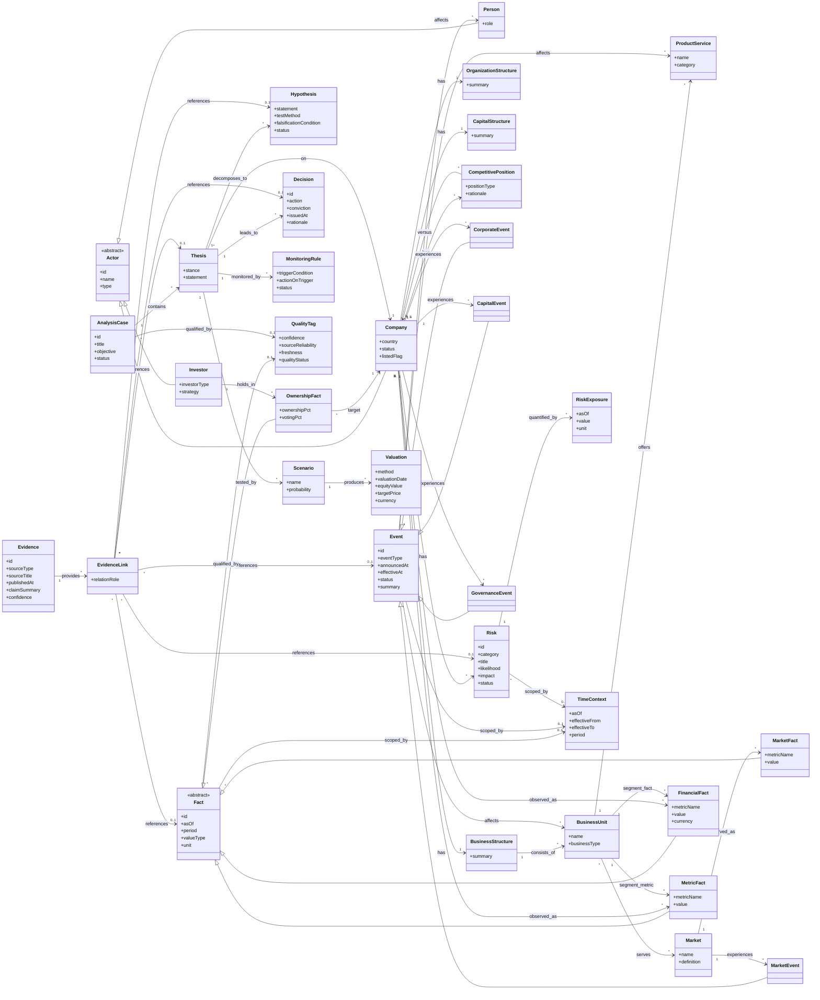

# 概要

みえるマンは企業分析プラットフォームです．

# 概念モデル（概要）

```mermaid
classDiagram
direction LR

%% =========================================
%% Core Actors
%% =========================================
class Actor {
    <<abstract>>
    +id
    +name
    +type
}
class Company {
    +country
    +status
    +listedFlag
}
class Investor {
    +investorType
    +strategy
}
class Person {
    +role
}
Actor <|-- Company
Actor <|-- Investor
Actor <|-- Person

%% =========================================
%% Structure (What the company IS)
%% =========================================
class BusinessStructure {
    +summary
}
class BusinessUnit {
    +name
    +businessType
}
class ProductService {
    +name
    +category
}
class Market {
    +name
    +definition
}
class OrganizationStructure {
    +summary
}
class CapitalStructure {
    +summary
}
class CompetitivePosition {
    +positionType
    +rationale
}

Company "1" --> "1" BusinessStructure : has
BusinessStructure "1" --> "*" BusinessUnit : consists_of
BusinessUnit "1" --> "*" ProductService : offers
BusinessUnit "*" --> "*" Market : serves
Company "1" --> "1" OrganizationStructure : has
Company "1" --> "1" CapitalStructure : has
Company "1" --> "*" CompetitivePosition : has
CompetitivePosition "*" --> "1" Company : versus

%% =========================================
%% Facts (Observed state, time-aware)
%% =========================================
class Fact {
    <<abstract>>
    +id
    +asOf
    +period
    +valueType
    +unit
}
class FinancialFact {
    +metricName
    +value
    +currency
}
class MetricFact {
    +metricName
    +value
}
class OwnershipFact {
    +ownershipPct
    +votingPct
}
class MarketFact {
    +metricName
    +value
}

Fact <|-- FinancialFact
Fact <|-- MetricFact
Fact <|-- OwnershipFact
Fact <|-- MarketFact

Company "1" --> "*" FinancialFact : observed_as
Company "1" --> "*" MetricFact : observed_as
Investor "1" --> "*" OwnershipFact : holds_in
OwnershipFact "*" --> "1" Company : target
Market "1" --> "*" MarketFact : observed_as
BusinessUnit "1" --> "*" FinancialFact : segment_fact
BusinessUnit "1" --> "*" MetricFact : segment_metric

%% =========================================
%% Events (What changed)
%% =========================================
class Event {
    +id
    +eventType
    +announcedAt
    +effectiveAt
    +status
    +summary
}
class CorporateEvent
class CapitalEvent
class GovernanceEvent
class MarketEvent

Event <|-- CorporateEvent
Event <|-- CapitalEvent
Event <|-- GovernanceEvent
Event <|-- MarketEvent

Company "1" --> "*" CorporateEvent : experiences
Company "1" --> "*" CapitalEvent : experiences
Company "1" --> "*" GovernanceEvent : experiences
Market "1" --> "*" MarketEvent : experiences
Event "*" --> "*" BusinessUnit : affects
Event "*" --> "*" ProductService : affects
Event "*" --> "*" Person : affects

%% =========================================
%% Risks (Uncertainty / exposure)
%% =========================================
class Risk {
    +id
    +category
    +title
    +likelihood
    +impact
    +status
}
class RiskExposure {
    +asOf
    +value
    +unit
}
Company "1" --> "*" Risk : has
Risk "1" --> "*" RiskExposure : quantified_by

%% =========================================
%% Analysis (Interpretation layer)
%% =========================================
class AnalysisCase {
    +id
    +title
    +objective
    +status
}
class Thesis {
    +stance
    +statement
}
class Hypothesis {
    +statement
    +testMethod
    +falsificationCondition
    +status
}
class Scenario {
    +name
    +probability
}
class Valuation {
    +method
    +valuationDate
    +equityValue
    +targetPrice
    +currency
}

AnalysisCase "1" --> "*" Thesis : contains
Thesis "*" --> "1" Company : on
Thesis "1" --> "*" Hypothesis : decomposes_to
Thesis "1" --> "*" Scenario : tested_by
Scenario "1" --> "*" Valuation : produces

%% =========================================
%% Decision (Action layer)
%% =========================================
class Decision {
    +id
    +action
    +conviction
    +issuedAt
    +rationale
}
class MonitoringRule {
    +triggerCondition
    +actionOnTrigger
    +status
}

Thesis "1" --> "*" Decision : leads_to
Thesis "1" --> "*" MonitoringRule : monitored_by

%% =========================================
%% Evidence / Provenance (Grounding layer)
%% =========================================
class Evidence {
    +id
    +sourceType
    +sourceTitle
    +publishedAt
    +claimSummary
    +confidence
}
class EvidenceLink {
    +relationRole
}

Evidence "1" --> "*" EvidenceLink : provides
EvidenceLink "*" --> "0..1" Fact : references
EvidenceLink "*" --> "0..1" Event : references
EvidenceLink "*" --> "0..1" Risk : references
EvidenceLink "*" --> "0..1" Hypothesis : references
EvidenceLink "*" --> "0..1" Thesis : references
EvidenceLink "*" --> "0..1" Decision : references

%% =========================================
%% Meta semantics (cross-cutting)
%% =========================================
class TimeContext {
    +asOf
    +effectiveFrom
    +effectiveTo
    +period
}
class QualityTag {
    +confidence
    +sourceReliability
    +freshness
    +qualityStatus
}

Fact "*" --> "0..1" TimeContext : scoped_by
Event "*" --> "0..1" TimeContext : scoped_by
Risk "*" --> "0..1" TimeContext : scoped_by
Fact "*" --> "0..1" QualityTag : qualified_by
AnalysisCase "*" --> "0..1" QualityTag : qualified_by
```

