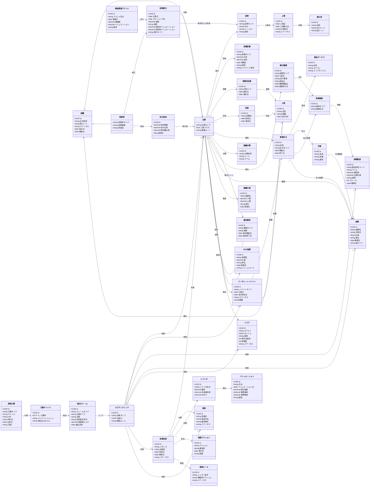

# ドメインモデル

## レビュー所見と改善方針

旧モデルは約45クラスを単一の図に詰め込んでいたため，「プロ投資家が稼げる判断をするための構造」が見えにくかった．
以下の観点で整理・削減した（約30クラスに集約）：

| 削減・統合の内容 | 理由 |
|---|---|
| `LegalEntity` を `組織` に吸収 | 法人登記情報は `組織` の属性で十分 |
| `CapTableSnapshot` / `Covenant` を削除 | 持分スナップショットは `持分保有` の基準日で代替；コベナンツは `負債証書` の属性へ |
| `Board` / `Committee` / `CompensationPlan` / `RelatedPartyRelationship` を削除 | ガバナンスは「誰が席に就いているか」だけに絞る |
| `RevenueModel` / `CustomerSegment` / `Channel` / `Facility` / `Supplier` / `ValueChainRelation` を削除 | 事業構造の詳細は運用フェーズで拡張；コアドメインに不要 |
| `MarketShareObservation` / `PricingObservation` を `指標` に統合 | 観測値の種別は `指標名` 属性で区別できる |
| `ReportingPeriod` を `開示書類` の属性へ | 一対一の期間情報はクラス分離不要 |
| `StatementLineItem` / `ReportedValue` / `NormalizedValue` を `財務数値` に統合 | 勘定科目・報告値・正規化値は単一レコードで管理 |
| `MetricDefinition` / `MetricObservation` / `Benchmark` / `BenchmarkValue` を `指標` に統合 | 定義と観測を分ける必要はドメイン層では不要 |
| `Restatement` / `AuditOpinion` / `Transcript` / `NewsItem` を削除 | 開示コンテキストは `コーポレートイベント` と `原典文書` で代替 |
| `ResearchProject` を削除，`投資仮説` に統合 | 調査案件は仮説の集合体であり，独立エンティティ不要 |
| `ValuationModel` / `ValuationOutput` / `Assumption` を `バリュエーション` / `シナリオ` に統合 | 手法・出力・前提を一つのバリュエーションレコードで表現 |
| `RiskExposure` / `RegulatoryEvent` / `LitigationCase` を削除 | リスクの定量値・規制・訴訟は `リスク` 属性と `コーポレートイベント` で代替 |
| `ExtractionRun` / `DataQualityIssue` / `AsOfSnapshot` / `VersionedRecord` を削除 | インフラ・横断関心事はドメインモデルから除外し，実装設計で対応 |

---

## 概念モデル（改訂版）

