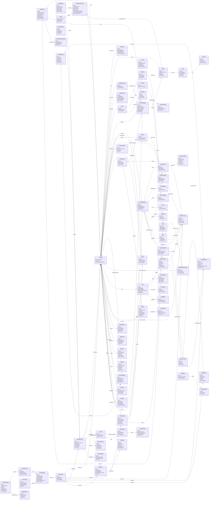

# ドメインモデル

## 概念モデル

```mermaid
classDiagram
direction LR

%% =========================
%% Core Registry
%% =========================
class Organization {
    +UUID id
    +string canonicalName
    +string localName
    +string countryCode
    +string status
    +date foundedDate
    +date dissolvedDate
}
class Company {
    +string companyType
    +bool isListed
    +string primaryIndustryCode
}
class Investor {
    +string investorType
    +string strategy
    +string domicile
}
class Person {
    +UUID id
    +string fullName
    +string nationality
    +date birthDate
}
class LegalEntity {
    +UUID id
    +string legalName
    +string registrationNo
    +string jurisdiction
    +date incorporationDate
}
class Exchange {
    +UUID id
    +string name
    +string micCode
    +string countryCode
}
class Security {
    +UUID id
    +string securityType
    +string isin
    +string ticker
    +string currency
}
class Listing {
    +UUID id
    +date listedDate
    +date delistedDate
    +string board
    +string status
}

Organization <|-- Company
Organization <|-- Investor
Company "1" --> "*" LegalEntity : owns/controls
Company "1" --> "*" Security : issues
Security "1" --> "*" Listing : listed_as
Listing "*" --> "1" Exchange : on
Person "*" --> "*" Organization : related_to

%% =========================
%% Ownership / Capital
%% =========================
class InvestmentTransaction {
    +UUID id
    +date announcedAt
    +date closedAt
    +decimal amount
    +string currency
    +decimal preMoneyValuation
    +decimal postMoneyValuation
    +string transactionType
}
class FundingRound {
    +UUID id
    +string roundLabel
    +date roundDate
    +decimal amount
    +string currency
    +decimal valuation
}
class OwnershipHolding {
    +UUID id
    +decimal shares
    +decimal ownershipPct
    +decimal votingPct
    +date effectiveFrom
    +date effectiveTo
    +date asOfDate
}
class CapTableSnapshot {
    +UUID id
    +date asOfDate
    +string sourceType
}
class DebtInstrument {
    +UUID id
    +string debtType
    +decimal principal
    +decimal interestRate
    +date maturityDate
    +string currency
}
class Covenant {
    +UUID id
    +string covenantType
    +string formula
    +string threshold
    +string breachStatus
}

Investor "1" --> "*" InvestmentTransaction : executes
InvestmentTransaction "*" --> "1" Company : target
InvestmentTransaction "*" --> "*" Security : acquires/disposes
FundingRound "1" --> "*" InvestmentTransaction : contains
Investor "1" --> "*" OwnershipHolding : holds
OwnershipHolding "*" --> "1" Security : security
OwnershipHolding "*" --> "1" Company : issuer
Company "1" --> "*" CapTableSnapshot : has
CapTableSnapshot "1" --> "*" OwnershipHolding : snapshot_items
Company "1" --> "*" DebtInstrument : has_debt
DebtInstrument "1" --> "*" Covenant : subject_to

%% =========================
%% Governance
%% =========================
class Board {
    +UUID id
    +date effectiveFrom
    +date effectiveTo
}
class BoardSeat {
    +UUID id
    +string seatType
    +date startDate
    +date endDate
}
class Committee {
    +UUID id
    +string committeeType
}
class OfficerRole {
    +UUID id
    +string title
    +date startDate
    +date endDate
}
class CompensationPlan {
    +UUID id
    +string planType
    +decimal targetAmount
    +string currency
}
class RelatedPartyRelationship {
    +UUID id
    +string relationType
    +date effectiveFrom
    +date effectiveTo
}

Company "1" --> "*" Board : has_board
Board "1" --> "*" BoardSeat : seats
BoardSeat "*" --> "1" Person : occupied_by
Board "1" --> "*" Committee : has_committee
Company "1" --> "*" OfficerRole : appoints
OfficerRole "*" --> "1" Person : held_by
OfficerRole "1" --> "*" CompensationPlan : compensated_by
Organization "*" --> "*" RelatedPartyRelationship : related_party

%% =========================
%% Business Architecture
%% =========================
class BusinessSegment {
    +UUID id
    +string name
    +string segmentType
    +date effectiveFrom
    +date effectiveTo
}
class ProductService {
    +UUID id
    +string name
    +string category
    +string lifecycleStage
}
class RevenueModel {
    +UUID id
    +string modelType
}
class CustomerSegment {
    +UUID id
    +string name
    +string segmentRule
}
class Channel {
    +UUID id
    +string channelType
}
class Geography {
    +UUID id
    +string name
    +string geoType
}
class Facility {
    +UUID id
    +string facilityType
    +string countryCode
    +decimal capacity
}
class Supplier {
    +UUID id
    +string supplierType
    +string countryCode
}
class ValueChainRelation {
    +UUID id
    +string relationType
    +date effectiveFrom
    +date effectiveTo
}

Company "1" --> "*" BusinessSegment : operates
BusinessSegment "1" --> "*" ProductService : offers
BusinessSegment "*" --> "1" RevenueModel : monetized_by
BusinessSegment "*" --> "*" CustomerSegment : serves
BusinessSegment "*" --> "*" Channel : uses
BusinessSegment "*" --> "*" Geography : active_in
Company "1" --> "*" Facility : owns/operates
Company "1" --> "*" Supplier : contracts
Company "1" --> "*" ValueChainRelation : value_chain_edges
Supplier "1" --> "*" ValueChainRelation : source_side
BusinessSegment "1" --> "*" ValueChainRelation : target_side

%% =========================
%% Market / Competition
%% =========================
class IndustryTaxonomy {
    +UUID id
    +string taxonomyName
    +string code
    +string label
}
class Market {
    +UUID id
    +string name
    +string definition
    +string currency
}
class CompetitorRelation {
    +UUID id
    +string relationType
    +string rationale
    +date effectiveFrom
    +date effectiveTo
}
class MarketShareObservation {
    +UUID id
    +date asOfDate
    +decimal sharePct
    +string methodology
}
class PricingObservation {
    +UUID id
    +date observedAt
    +decimal price
    +string currency
    +string unit
    +string condition
}

Company "*" --> "*" IndustryTaxonomy : classified_as
BusinessSegment "*" --> "*" Market : addresses
Company "*" --> "*" Company : competes_with
Company "1" --> "*" CompetitorRelation : competition_edges
CompetitorRelation "*" --> "1" Company : against
Market "1" --> "*" MarketShareObservation : has_share_obs
Company "1" --> "*" MarketShareObservation : observed_company
ProductService "1" --> "*" PricingObservation : priced_at

%% =========================
%% Financials / Accounting
%% =========================
class ReportingPeriod {
    +UUID id
    +string periodType
    +date startDate
    +date endDate
    +date asOfDate
}
class Filing {
    +UUID id
    +string filingType
    +date publishedAt
    +string accountingStandard
    +string auditor
    +string language
}
class FinancialStatement {
    +UUID id
    +string statementType
    +string consolidation
    +string basisType
}
class StatementLineItem {
    +UUID id
    +string code
    +string label
    +string lineType
}
class ReportedValue {
    +UUID id
    +decimal value
    +string currency
    +string unit
    +int scale
    +date observedAt
}
class NormalizedValue {
    +UUID id
    +decimal value
    +string currency
    +string unit
    +string normalizationRuleSet
    +date createdAt
}
class Restatement {
    +UUID id
    +string reason
    +date announcedAt
}
class AuditOpinion {
    +UUID id
    +string opinionType
    +string emphasisMatter
}

Company "1" --> "*" Filing : files
Filing "*" --> "1" ReportingPeriod : covers
Filing "1" --> "*" FinancialStatement : contains
FinancialStatement "1" --> "*" StatementLineItem : has_lines
StatementLineItem "1" --> "*" ReportedValue : reported_values
StatementLineItem "1" --> "*" NormalizedValue : normalized_values
Filing "1" --> "*" Restatement : may_restate
Filing "1" --> "0..1" AuditOpinion : audited_by
BusinessSegment "1" --> "*" FinancialStatement : segment_financials

%% =========================
%% Metrics / Targets / Benchmarks
%% =========================
class MetricDefinition {
    +UUID id
    +string name
    +string formula
    +string unit
    +string category
    +string scopeType
}
class MetricObservation {
    +UUID id
    +decimal value
    +string unit
    +date observedAt
    +string valueType
}
class Benchmark {
    +UUID id
    +string benchmarkType
    +string methodology
}
class BenchmarkValue {
    +UUID id
    +decimal value
    +date asOfDate
}

MetricDefinition "1" --> "*" MetricObservation : instances
Company "1" --> "*" MetricObservation : company_metric
BusinessSegment "1" --> "*" MetricObservation : segment_metric
ProductService "1" --> "*" MetricObservation : product_metric
Market "1" --> "*" MetricObservation : market_metric
Benchmark "1" --> "*" BenchmarkValue : values
MetricDefinition "1" --> "*" Benchmark : benchmarked_by

%% =========================
%% Risk / Compliance / ESG
%% =========================
class RiskItem {
    +UUID id
    +string riskCategory
    +string title
    +string description
    +int likelihoodScore
    +int impactScore
    +string status
}
class RiskExposure {
    +UUID id
    +date asOfDate
    +decimal exposureValue
    +string currency
}
class RegulatoryEvent {
    +UUID id
    +string regulator
    +string eventType
    +date eventDate
    +string status
}
class LitigationCase {
    +UUID id
    +string caseType
    +string jurisdiction
    +date filedDate
    +string status
}
class ESGMetric {
    +UUID id
    +string metricName
    +decimal value
    +string unit
    +date asOfDate
    +string framework
}

Company "1" --> "*" RiskItem : has_risks
RiskItem "1" --> "*" RiskExposure : quantified_by
Company "1" --> "*" RegulatoryEvent : receives
Company "1" --> "*" LitigationCase : involved_in
Company "1" --> "*" ESGMetric : reports

%% =========================
%% Events / News / Guidance
%% =========================
class CorporateEvent {
    +UUID id
    +string eventType
    +date announcedAt
    +date effectiveAt
    +string status
    +string summary
}
class Guidance {
    +UUID id
    +string metricName
    +decimal low
    +decimal high
    +string unit
    +date issuedAt
}
class Transcript {
    +UUID id
    +string transcriptType
    +date eventDate
    +string language
}
class NewsItem {
    +UUID id
    +string headline
    +string publisher
    +date publishedAt
    +string sentimentLabel
}

Company "1" --> "*" CorporateEvent : has_events
Company "1" --> "*" Guidance : issues
Company "1" --> "*" Transcript : appears_in
Company "1" --> "*" NewsItem : mentioned_in
CorporateEvent "*" --> "*" BusinessSegment : affects
CorporateEvent "*" --> "*" Facility : affects
CorporateEvent "*" --> "*" Person : affects

%% =========================
%% Research / Valuation / Decision
%% =========================
class ResearchProject {
    +UUID id
    +string title
    +string objective
    +date createdAt
    +string status
}
class InvestmentThesis {
    +UUID id
    +string thesisStatement
    +string stance
    +date createdAt
    +date revisedAt
    +string status
}
class Hypothesis {
    +UUID id
    +string statement
    +string testMethod
    +string falsificationCondition
    +string status
}
class Assumption {
    +UUID id
    +string name
    +decimal value
    +string unit
    +date effectiveFrom
    +date effectiveTo
}
class Scenario {
    +UUID id
    +string scenarioType
    +decimal probability
}
class ValuationModel {
    +UUID id
    +string modelType
    +string currency
    +date valuationDate
}
class ValuationOutput {
    +UUID id
    +decimal equityValue
    +decimal enterpriseValue
    +decimal targetPrice
    +string currency
}
class Recommendation {
    +UUID id
    +string action
    +string conviction
    +date issuedAt
    +string rationale
}
class MonitoringRule {
    +UUID id
    +string triggerCondition
    +string actionOnTrigger
    +string status
}

ResearchProject "1" --> "*" InvestmentThesis : contains
InvestmentThesis "*" --> "1" Company : on_company
InvestmentThesis "1" --> "*" Hypothesis : decomposes_to
Hypothesis "1" --> "*" Assumption : depends_on
InvestmentThesis "1" --> "*" Scenario : evaluated_by
Scenario "1" --> "*" Assumption : scenario_assumptions
Scenario "1" --> "*" ValuationModel : uses
ValuationModel "1" --> "1..*" ValuationOutput : outputs
InvestmentThesis "1" --> "*" Recommendation : produces
InvestmentThesis "1" --> "*" MonitoringRule : monitored_by

%% =========================
%% Evidence / Provenance / RAG grounding
%% =========================
class SourceDocument {
    +UUID id
    +string sourceType
    +string title
    +string uri
    +string publisher
    +date publishedAt
    +string language
}
class DocumentChunk {
    +UUID id
    +int chunkIndex
    +string contentHash
    +string embeddingModel
}
class ExtractedClaim {
    +UUID id
    +string claimType
    +string subjectType
    +string predicate
    +string objectText
    +decimal confidenceScore
    +date extractedAt
}
class EvidenceLink {
    +UUID id
    +string targetType
    +UUID targetId
    +string relationRole
}
class ExtractionRun {
    +UUID id
    +string extractorType
    +string modelName
    +string promptVersion
    +date runAt
}
class DataQualityIssue {
    +UUID id
    +string issueType
    +string severity
    +string status
}

SourceDocument "1" --> "*" DocumentChunk : split_into
DocumentChunk "1" --> "*" ExtractedClaim : yields
ExtractionRun "1" --> "*" ExtractedClaim : produced
ExtractedClaim "1" --> "*" EvidenceLink : linked_to
SourceDocument "1" --> "*" DataQualityIssue : has_quality_issue

EvidenceLink "*" --> "0..1" Company : references
EvidenceLink "*" --> "0..1" CorporateEvent : references
EvidenceLink "*" --> "0..1" MetricObservation : references
EvidenceLink "*" --> "0..1" ReportedValue : references
EvidenceLink "*" --> "0..1" NormalizedValue : references
EvidenceLink "*" --> "0..1" InvestmentThesis : references
EvidenceLink "*" --> "0..1" Hypothesis : references

%% =========================
%% Cross-cutting Time/Version semantics
%% =========================
class AsOfSnapshot {
    +UUID id
    +date asOfDate
    +string scopeType
    +UUID scopeId
}
class VersionedRecord {
    +UUID id
    +int versionNo
    +date validFrom
    +date validTo
    +date recordedAt
    +bool isCurrent
}

AsOfSnapshot "1" --> "*" OwnershipHolding : includes
AsOfSnapshot "1" --> "*" MetricObservation : includes
AsOfSnapshot "1" --> "*" RiskItem : includes
VersionedRecord "*" --> "0..1" InvestmentThesis : versions
VersionedRecord "*" --> "0..1" NormalizedValue : versions
VersionedRecord "*" --> "0..1" CompetitorRelation : versions
```
