# technologies: 01_クラス図を使った概念モデリングと実装プラクティス

# アジェンダ

* 抽象化
* 一般化
* 構造化
* Javaによる実装

## 抽象化
私たちが物事や人を認識する際、それらに共通な特徴を抜き出して、ある概念としてとらえます。
これを抽象化といいます。
集合で考えると、具体的な人や物事である個々の要素が、集合という概念に属するという関係を作ります。
下記のベン図は、一人一人の具体的な人が、「ヒト」という集合に属していることを意味しています。

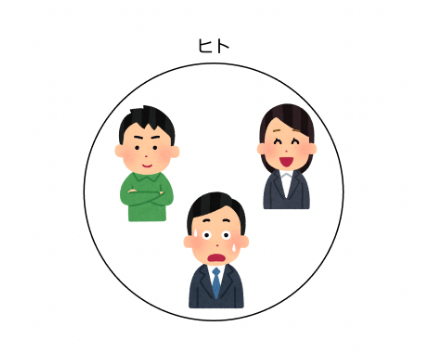

この場合、例えば、「歩く」ものの集合、

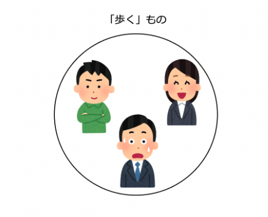

「体温がある」ものの集合、

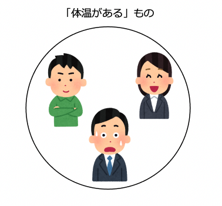

のように、なんらかの特徴を抜き出して、概念としてまとめていきます。
UMLでは、クラス図のクラスとして「概念」を表すことができます。

この例では、「ヒト」というクラスにｈあ、「体温」という属性と「歩く」という操作があることを示しています。
「集合の条件」となる「要素に共通した特徴」のうち、静的な特徴をクラスの属性、動的な特徴（機能）をクラスの操作としてとらえています。
※「集合の条件」は述語論理でいえば「述語」の部分なので、属性や操作は述語論理の「述語」に相当します。
なお、クラスの表記ですが、クラス名だけ、クラス名と属性、クラス名と操作など、省略して書くことができます。

さて、集合というと、集合（タイプ）がUMLのクラス、集合に属する要素（インスタンス）がUMLのオブジェクトとなります。

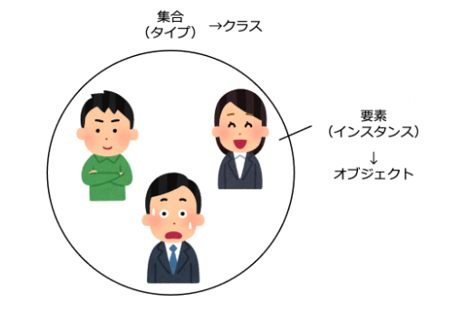

オブジェクトは次のように書きます。

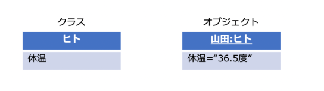

オブジェクトはインスタンス（実例）なので、クラス名と属性の具体的な値が示されています。

## 一般化
ここで、次のような集合を考えてみましょう。

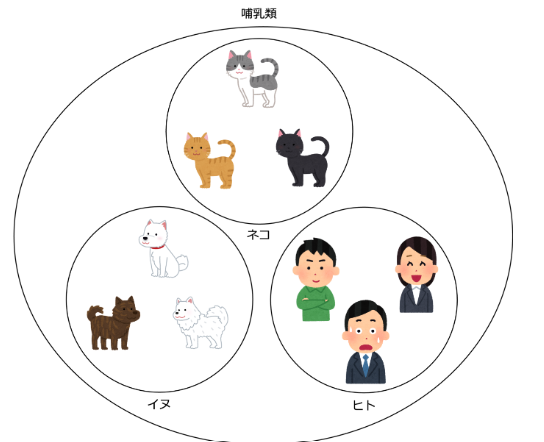

「体温がある」とか「歩く」とかは、ヒトだけではなく、ネコやイヌにも当てはまるので、「哺乳類」というさらに上位概念の集合を考え、その部分集合として、「ネコ」、「イヌ」、「ヒト」を位置づけることができます。
UMLでは、次のように、汎化関係を使って、集合と部分集合の関係を表すことができます。

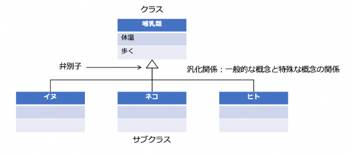

汎化関係の先にある三角の記号を弁別子といいます。
汎化関係は、より一般的な上位概念と特殊な下位概念との関係を表します。
汎化関係の上位概念であるクラスに対して、下位概念をサブクラスと呼びます。
逆に、下位概念であるクラスに対して、上位概念をスーパークラスと呼びます。
下位の概念から上位の概念に導くことを一般化とよびます。

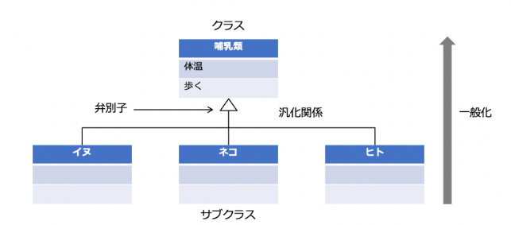

さて、このクラス図を見ると、サブクラスに属性と操作が書かれていないことがわかります。
クラス間の汎化関係がある場合、上位クラスの特徴である属性と操作を、下位クラスが継承します。
なので、サブクラスの属性と操作は省略することができます。

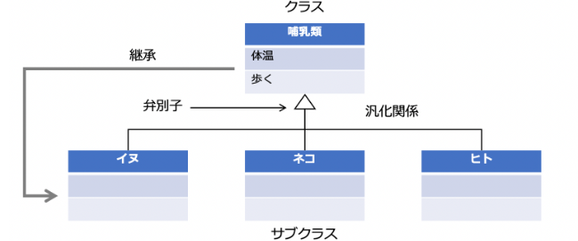

汎化関係について、もう少し詳細に見ていきましょう。
集合と部分集合の関係を考えた場合、交わりがある場合とない場合があります。

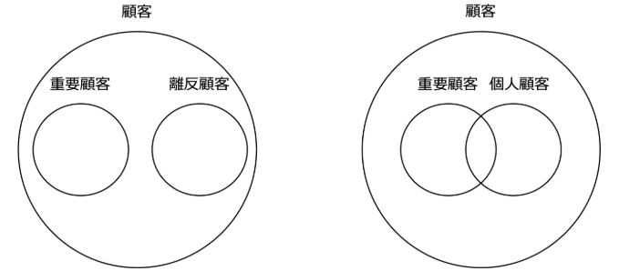

これをクラス図で表すと次の図のようになります。

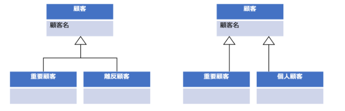

集合が交わりを持つ場合、弁別子を分けて記述します。
さらに、次の図のように、汎化関係に{完全}という制約をつけることで、オブジェクトがサブクラスのいづれかに属するという制約を設けることができます。

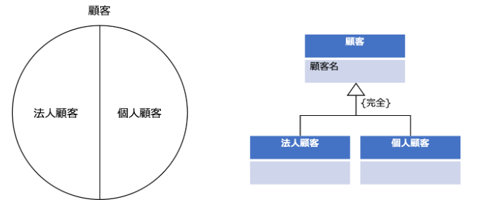

また、汎化関係に「動的」というステレオタイプをつけることで、オブジェクトが、その弁別子のクラスまたはサブクラスに動的に所属を移動できることを示すことができます。

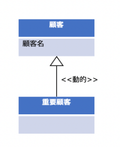

この例の場合、ある顧客が重要顧客になったり、ならなかったりすることが示されています。
なお、クラスの属性のうち、オブジェクトを一意に識別するものを識別子といいます。
「顧客名」が顧客オブジェクトを一意に識別するものであれば識別子になりますし、そうでなければ「顧客番号」などの識別子を特別に設けることもできます。

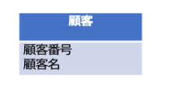

## 構造化

クラス図の4種類の関係、
* 関連
* 依存
* 汎化
* 実現
を使うことで、システムの静的な論理構造（静的モデル）を表すことができます。

### 関連

クラス図では、クラスの意味的な関係を関連で表すことができます。
次の例は、会社が社員を「雇用する」という関係を関連で表しています。

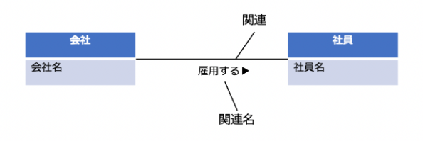

関連には、関連の意味を表す関連名を付けることができます。
※黒い三角は、関連の方向性を示しています。
ここでは、関連について次の観点で説明します。

* 多重度
* 集約
* 5W1H
* 分解と分類
* 一般化と抽象化
* 同一性と等価性

#### 多重度
次のクラス図は、車がタイヤを所有するという関連を表しています。
車やタイヤの属性「製造番号」は、車やタイヤオブジェクト（個体）一つ一つを識別する識別子です。

クラス間に関連がある場合、一方のクラスの一つのオブジェクトに対して、他方のクラスのオブジェクトがいくつあり得るか、その数を多重度で表すことができます。
上の例の場合、一つの車オブジェクトにタイヤが４つついているので、タイヤ側の多重度が４になっています。
また、一つのタイヤに対して車の本体は一つしかないので、車側の多重度は１になっています。
多重度の数を範囲（レンジ）で表したい場合、次の例のように表すことができます。

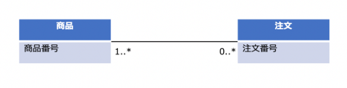

この例では、一つの商品オブジェクトに対して注文オブジェクトの多重度が0..*になっています。
この0..*は、0以上複数という範囲を表します。
具体的な数はわからないが複数ある場合は、*（アスタリスク）を使います。
上の例の場合、ある種類の商品は、何度も注文される可能性があるが、一度も注文されていない場合もあり得るので、注文側の多重度が0..*になっています。
また、注文は、購買対象の商品がないと成り立たない、かつ、１回の注文で数はわからないが複数の商品を買う場合があるので、商品側の多重度が1..*になっています。

#### 集約
さて、先ほどの車がタイヤを所有するという関連ですが、「所有する」という関係は大変ポピュラーなので、クラス図では、集約（aggregation）という、全体が部分を「所有する」という特別な関連を用意しています。
次の図は、先ほどの車とタイヤの例と同じ意味を表しています。

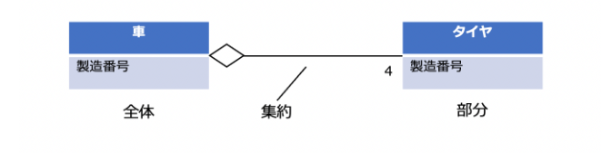

全体が部分を「所有する」という関連がある場合、全体側のクラスの先に菱形をつけることで、その意味を表すことができます。
さらに、全体側の菱形を黒くすると、集約をコンポジション（composition）にすることができます。

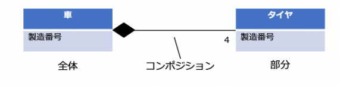

強い集約を表すコンポジションを使うことで、全体側のオブジェクトが消滅すると部分側のオブジェクトも消滅するといように、全体と部分のオブジェクトのライフサイクルが同じであることを表すことができます。
上の例の場合、車を燃やすとタイヤも一緒に燃えてなくなるので、全体と部分のオブジェクトのライフサイクルが同じであることを表すためにコンポジションを使っています。

#### 5W1H

このように、集約は代表的な関連ですが、もう一つの代表的な関連として5W1Hがあります。
私たちの思考を分解すると5W1Hに分解することができます。
例えば「出荷」という事象を考えてみましょう。
この出荷など事象は、５W１HのWhenとHow（いつどのように）を表す事実になります。
それでは「出荷」を中心に５W１Hの残りの要素を踏まえて概念構造を考えてみましょう。

* なぜ出荷したのか（Why）
    * 出荷の原因となった事象として「受注」が関連します。
* なにを出荷したのか（What）
    * 出荷対象としての「製品」が関連します。
* どこに出荷したのか（Where）
    * 出荷先としての「顧客」が関連します。
* だれが出荷したのか（Who）
    * 出荷者としての「社員」が関連します。

以上を踏まえて概念モデルを描くと次のようになります。

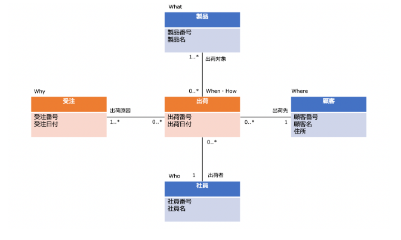

#### 分解と分類
さて、前に汎化関係によってクラスの属性と操作がサブクラスに継承されると説明しましたが、もう一つ、関係も継承されます。

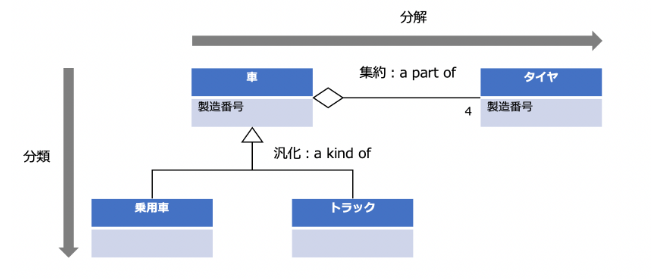

この例の場合、車がタイヤを持つという関連が、乗用車とトラックに継承されるので、乗用車もトラックもタイヤを持つことになります。
このクラス図は、
タイヤは車の一部である
乗用車とトラックは車の一種である
という関係を表しています。
集約は、全体と部分の関係（a part of：〜の一部）により概念を分解するときに使います。
汎化は、一般と特殊の関係(a kinf of：〜の一種）により概念を分類するときに使います。
システムは、複数の要素が有機的に関係する全体です。
私たちは、分析することによって、システムの構造を明らかにしようとしますが、分析には、分解と分類があります。
分析＝分解×分類
なのです。
クラス図を使うと、集約と汎化を使ってシステムを分析することができるのです。

#### 一般化と抽象化

次に、一般化と抽象化について説明します。
前に
「哺乳類」という集合は、ネコ、イヌ、ヒトという部分集合を含む
という例を出しましたが、下図のように、
「哺乳類の種類」という集合には、ネコ、イヌ、ヒトという要素が属する
という集合も考えることができます。

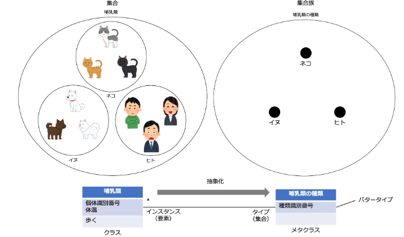

ある集合の部分集合を要素にする集合を、その集合の集合族といいます。
上の例の右側の「哺乳類の種類」という集合は、「哺乳類」という集合の集合族になります。
これをクラス図で表すと、「哺乳類の種類」クラスは、哺乳類の種類を識別する識別子「種類識別番号」を持ち、「哺乳類」クラスは、哺乳類の個体を識別する識別子「固体識別番号」を持つので、「哺乳類の種類」クラスと「哺乳類」クラスの関連は、タイプ（集合）とインスタンス（要素）の１対多の関係になります。
あるクラスのサブクラスをインスタンスに持つクラスのことを、そのクラスのメタクラス、または、パワータイプといいます。
また、「哺乳類」クラスから「哺乳類の種類」クラスを考える過程は、インスタンス（要素）からタイプ（集合）を考える過程なので「抽象化」ということになります。
クラス図を使うと、
サブクラスとクラスの汎化関係で一般化
クラスとメタクラス（パワータイプ）の関連で抽象化
の関係を表すことができるのです。

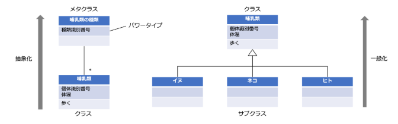

#### 同一性と等価性

次に、オブジェクトの重要な性質である同一性と等価性について説明します。

**同一性**
オブジェクトが同一(identical）とは、オブジェクトが時や場所を越えて、それ自身と同じであるということです。
これは、個々のオブジェクトがID（identifier：識別子）を持つことを意味します。
同一性（identity）とは、オブジェクトが持つ、同一であるかどうかを示す性質のことです。
同一性を持つオブジェクトはコピーできません。
例えば、NFT（non-fungible token：非代替性トークン）は同一性を持つオブジェクトです。
NFTとは、ブロックチェーン上に記録される一意で代替不可能なデータ単位で、画像・動画・音声、およびその他の種類のデジタルファイルなど、容易に複製可能なアイテムを一意なアイテムとして関連づけることができるものです。
ソフトウェア開発で、問題領域（ドメイン）に存在するオブジェクトを分析するときに重要な観点は、オブジェクトの同一性を意識するかどうかです。

**等価性**
オブジェクトが等価（equivalent）とは、オブジェクトの値が等しいということです。
これは、オブジェクトの持つ状態変数の値が等しいことを意味します。
等価性（equivalence）とは、オブジェクトが持つ、等価かどうかを示す性質のことです。
ビットコインなどの暗号通貨も含め通貨には等価性があります。
Aさんが持つ１０００円とBさんが持つ１０００円は、同一性はありませんが、同じ１０００円という価値を持ちます。
ソフトウェア開発で、問題領域（ドメイン）に存在するオブジェクトを分析するときに重要な観点は、オブジェクトの等価性を意識するかどうかです。
オブジェクトにおける同一性と等価性の関係は、論理包含の関係になります。
同一⇒等価
つまり、同一（IDが同じ）ならば等価（値も同じ）という論理関係です。
同一（IDは同じ）だけど等価でない（値は違う）という状況はありません。
Aさんが持つ１０００円もBさんが持つ１０００円は、同一性はありませんが、同じ１０００円という価値を持ちます。
これは、「同一ではないが等価である」という例です。
同一性を持つオブジェクトのことを参照オブジェクト(reference object）といいます。
また、参照オブジェクトのクラスをエンティティといいます。
同一ではないが等価であるオブジェクトのことを値オブジェクト(value object）といいます。
次の図は、製品のパワータイプである製品アイテムが、色、サイズ、外形という分類基準によって製品を分類することを表しています。

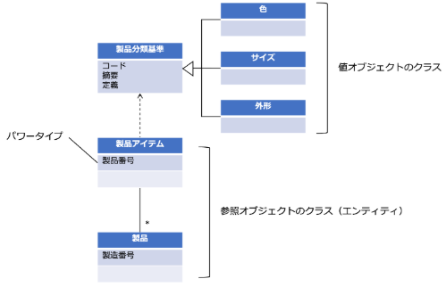

製品の識別子である「製造番号」は製品個体一つ一つを識別する番号ですが、製品アイテムの識別子である「製品番号」は製品の種類一つ一つを識別する番号です。
なので、製品アイテムと製品は参照オブジェクトのクラス（エンティティ）です。
一方、コード、摘要、定義しか属性を持たない分類基準、色、サイズ、外形は値オブジェクトのクラスになります。

#### 依存
次のクラス図は、大工がノコギリを使うという関係を表しています。

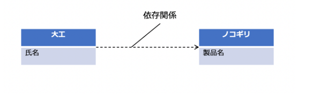

UMLでは、矢印のついた破線でクラス同士の依存関係（dependency）を表します。
この例の場合、大工は仕事でノコギリを使うので、大工はノコギリに依存していることを表しています。
クラス間が「関連」で結ばれている場合、暗黙的に「依存関係」が発生します。
先ほどの会社が社員を「雇用する」という関連の場合、会社は社員に、社員は会社に依存していることになります。
会社と社員の関係の場合、相手の存在が自身に強く関わります。
それに比べて、大工とノコギリの場合、それほど強い関連があるわけではありません。
なぜならば、大工はノコギリないと仕事ができないわけではないからです。
このように、互いの関係がそれほど強くない一時的な関係の場合、依存関係を使います。

#### 実現

上位クラスで操作の仕様部分を定義して、下位クラスの操作で、その仕様を実現する場合、実現関係（realization）を使います。
実現関係は、上位クラスの操作の仕様のみを下位クラスが継承するという特別な汎化関係です。
操作の仕様だけが定義されている場合、interfaceというステレオタイプを使うことで、そのクラスをインターフェースとして定義することができます。
次のクラス図では、乗り物インターフェースで乗り物は走る機能を持つことだけを定義して、下位クラスである車と電車で、その機能を具体的に実現していることを表しています。

